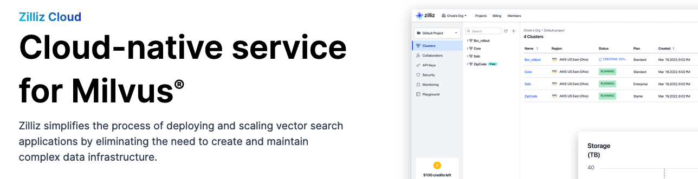
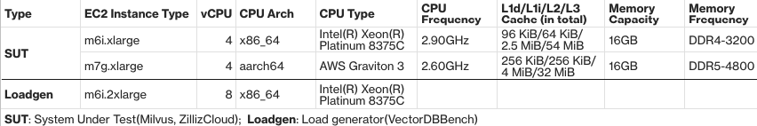
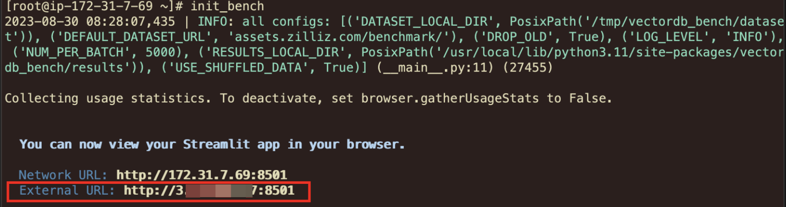
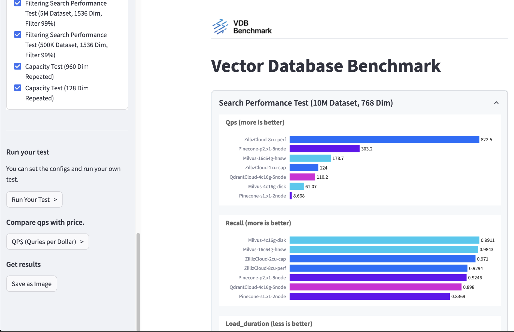
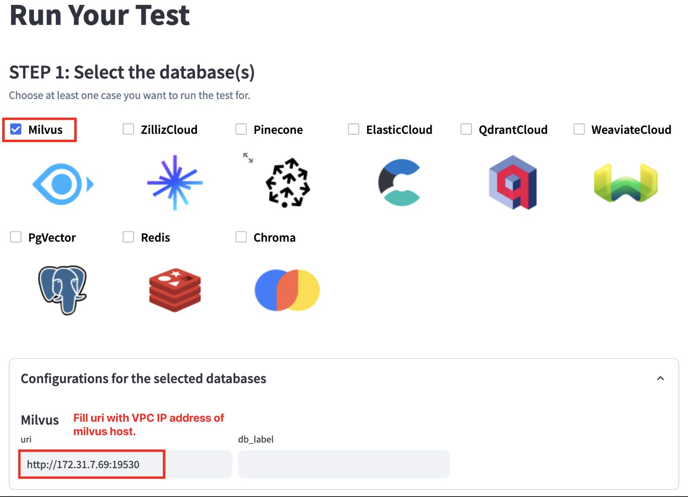
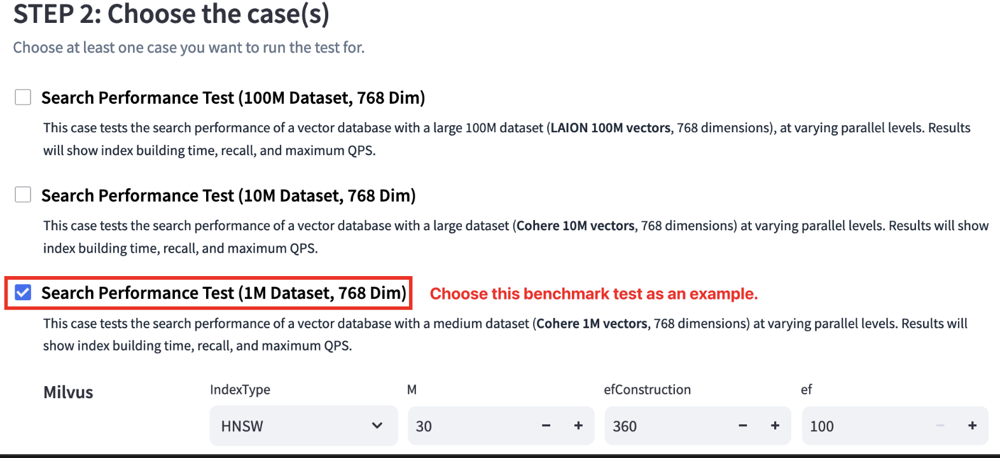
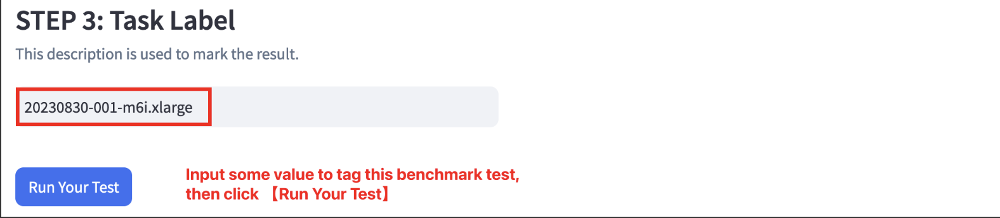
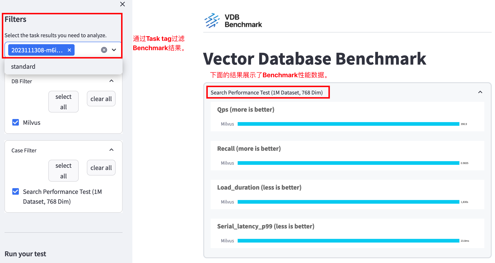
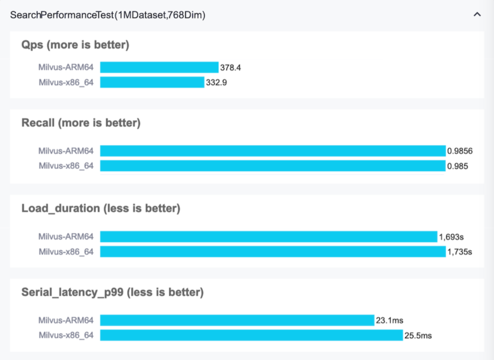

# 开源向量数据库Milvus借助亚马逊云科技Graviton3实例，实现实例性价比高达31%的提升

<picture>
 
</picture>

<sub> _亚马逊云科技博客 白雪尧 & 袁泉 & 吴万涛_ <sub>

生成式 AI（Generative AI）的火爆引发了广泛的关注，也彻底点燃了向量数据库（Vector Database）市场，众多的向量数据库产品开始真正出圈，走进大众的视野。

根据 IDC 的预测，到 2025 年，超过 80% 的业务数据将是非结构化的，以文本、图像、音频、视频或其他格式存储。而大规模存储和查询非结构化数据是一个非常大的挑战。

在生成式 AI 和深度学习领域通常的做法是通过将非结构化数据转换为向量进行存储，并通过向量相似性搜索（Vector similarity search）技术进行语义相关性搜索。而快速地存储、索引和搜索 Embedding 向量，正是向量数据库的核心功能。

当前市面上主流的向量数据库可以分为两大类，一类是在既有数据库产品上进行扩展，例如 Amazon OpenSearch 服务通过 KNN 插件、Amazon RDS for PostgreSQL 通过 pgvector 扩展实现对向量的支持。另一类是独立的向量数据库产品，比较知名的有 Milvus、Zilliz Cloud（powered by Milvus）、Pinecone、Weaviate、Qdrant、Chroma 等。在这类向量数据库中，向量是一等公民，所有的功能都是围绕着它建立的。

Embedding 技术和向量数据库可以被广泛应用于各类 AI 驱动的应用场景，包括图片检索、视频分析、自然语言理解、推荐系统、定向广告、个性化搜索、智能客服和欺诈检测等。

在众多的向量数据库中，Milvus 是全球最流行的开源向量数据库之一，截止本文创作时至，在 Github 有超过 2.3 万颗 Star。且看 Milvus 的官方介绍：

> Milvus 是一个高度灵活、可靠且速度极快的云原生开源向量数据库。它为 embedding 相似性搜索和 AI 应用程序提供支持，并努力使每个组织都可以访问向量数据库。 Milvus 可以存储、索引和管理由深度神经网络和其他机器学习（ML）模型生成的十亿级别以上的 embedding 向量。

## 关于 Amazon Graviton

AWS Graviton 处理器由 AWS 设计，旨在为 Amazon EC2 中运行的云工作负载提供最佳性价比。

AWS Graviton3 处理器是 AWS Graviton 处理器系列中的最新产品。与 AWS Graviton2 处理器相比，它们的计算性能提高了 25%，浮点性能提高了 2 倍，加密工作负载性能提高了 2 倍。与 AWS Graviton2 处理器相比，AWS Graviton3 处理器在 ML 工作负载方面的性能提高了 3 倍，包括对 bfloat16 的支持。它们还支持 DDR5 内存，与 DDR4 相比，内存带宽增加了 50%。与 AWS Graviton3 处理器相比，AWS Graviton3E 处理器的矢量指令性能提高了 35%。这一改进为 HPC 应用程序提供了更高的性能优势。

## 基准测试概述和测试目标

为了更好地了解 Graviton3 能够给用户自建Milvus提供的性能优劣情况，我们将针对 Intel Xeon Platinum 8375C 进行负载测试。
具体详情如下表所示：

<picture>
 
</picture>

<sub> _Graviton3 (m7g) VS Intel Xeon Platinum 8375C (m6i)_ <sub>
* 操作系统和存储:
    * AMI：Amazon Linux 2023 AMI(最新版本)
    * EBS：GP3, 80G(保持默认性能选项, Throughput 125MB/s, IOPS 3000)


### 基准测试工具 & 数据集介绍

我们将使用VectorDBBench来进行测试。 VectorDBBench 是进行最终性能和成本效益比较的首选工具。 VectorDBBench 的设计考虑到了易用性，旨在帮助用户（甚至是非专业人士）重现结果或测试新系统，从而轻松地在众多云服务和开源矢量数据库中寻找最佳选择。

我们使用Cohere https://huggingface.co/datasets/Cohere/wikipedia-22-12/tree/main/en 作为测试数据集。

### 方法原理

我们使用 HNSW 算法对 Cohere 1M 数据集进行索引。 HNSW（Hierarchical Navigable Small World）算法是一种近似最近邻（ANN）算法，用于索引和搜索高维数据。 它旨在解决高维空间中传统精确 k 个最近邻算法效率低下的快速最近邻搜索的挑战。 HNSW 算法有多个参数，您可以配置这些参数来自定义其行为。

* M: 此参数控制数据点在hierarchical graph中可以拥有的最大连接数. 
* **fConstruction**: 代表“ef Construction”，它在图的构建过程中控制动态列表的大小.
* **efSearch**: 该参数在搜索阶段使用，并在搜索最近邻居时控制动态列表的大小。较大的 efSearch 值可能会导致更详尽的搜索，但也会增加查询时间。

在我们的测试中，我们为 ARM64 和 X86 平台选择相同的参数。

### 安装Milvus 

* 分别使用 SSH 会话登录上面的 SUT EC2 实例。
* 执行以下命令设置 Milvus 2.3.2 基准环境：

```
sudo su - root

## Install Docker and docker-compose
dnf install -y docker git htop
systemctl start docker
ARCH=$(arch)
curl -SL https://github.com/docker/compose/releases/download/v2.12.2/docker-compose-linux-${ARCH} \
     -o ./docker-compose
chmod +x docker-compose
mv docker-compose /usr/bin/

## Start milvus container
mkdir ~/milvus
cd ~/milvus
wget https://github.com/milvus-io/milvus/releases/download/v2.3.2/milvus-standalone-docker-compose.yml \
  -O docker-compose.yml
docker-compose up -d
docker-compose ps

```

After above steps, you should get Milvus v2.3.2 running on both instances. 
执行完以上步骤，您应该在测试EC2实例上已经安装完成并运行Milvus v2.3.2
### 安装VectorDBBench 

我们接下来在负载生成实例上安装VectorDBBench, 请参考以下步骤以完成

```
sudo su - root

## Need isntall Python 3.11 or above
dnf install -y python3.11 python3.11-pip python3.11-devel git gcc gcc-c++
python3.11 -V

## Install VectorDBBench
pip3.11 install vectordb-bench
which init_bench

## Redirect /tmp/vectordb_bench to another location
mkdir -p /mnt/vectordb_bench
ln -s /mnt/vectordb_bench /tmp/vectordb_bench

## init benchmark tool，follow the prompt to enter web page
init_bench
```
<picture>
 
</picture>

通过外部 URL 访问 VectorDBBench Web 控制台，确保您已允许安全组中的端口 8501 并允许您的 VPC 中的流量。

<picture>
 
</picture>

### 进行压力测试

* 点击【Run Your Test >】按钮进入基准测试配置，按照如下所示的说明配置基准测试工具。

<picture>
 
</picture>

<picture>
 
</picture>

<picture>
 
</picture>


### 查看测试结果 

* 所有基准测试完成后，您可以通过 WebUI 查看结果

<picture>
 
</picture>

### Intel 和 Graviton3 实例之间的性能比较

经过以上针对 m6i (Intel) m7g(Graviton3) 的测试，我们得到最终结果如下：

<picture>
 
</picture>

## 总结

我们的测试表明，Milvus on Graviton3 (m7g) 的总体性能比 Intel Xeon Platinum 8375C (m6i) 实现了更好的 QPS (13.7%)。
考虑到价格(m6i相较m7g单价约贵17.6%)，我们的结果显示，与 m6i 系列实例上的 x86 处理器相比，Graviton3 可以带来高达 31% 的性价比提升。

我们鼓励读者尽可能尝试 Graviton3，感受 Graviton3 带来的性价比提升。


## 参考资料
* VDBBench https://github.com/zilliztech/VectorDBBench
* Cohere https://huggingface.co/datasets/Cohere/wikipedia-22-12/tree/main/en
* AWS EC2 Pricing https://aws.amazon.com/ec2/pricing/on-demand/

